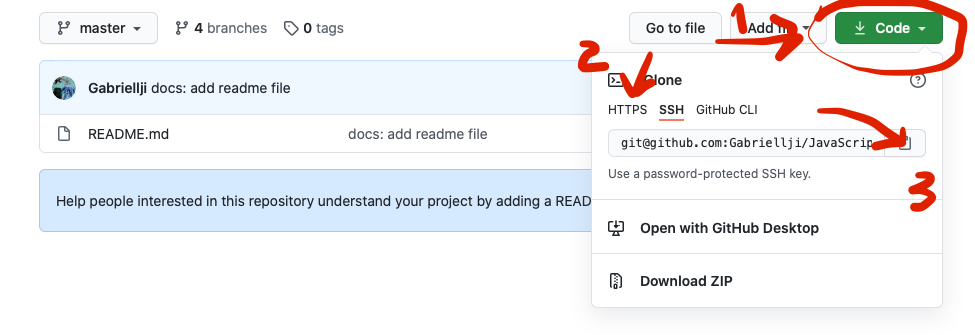
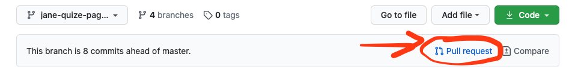
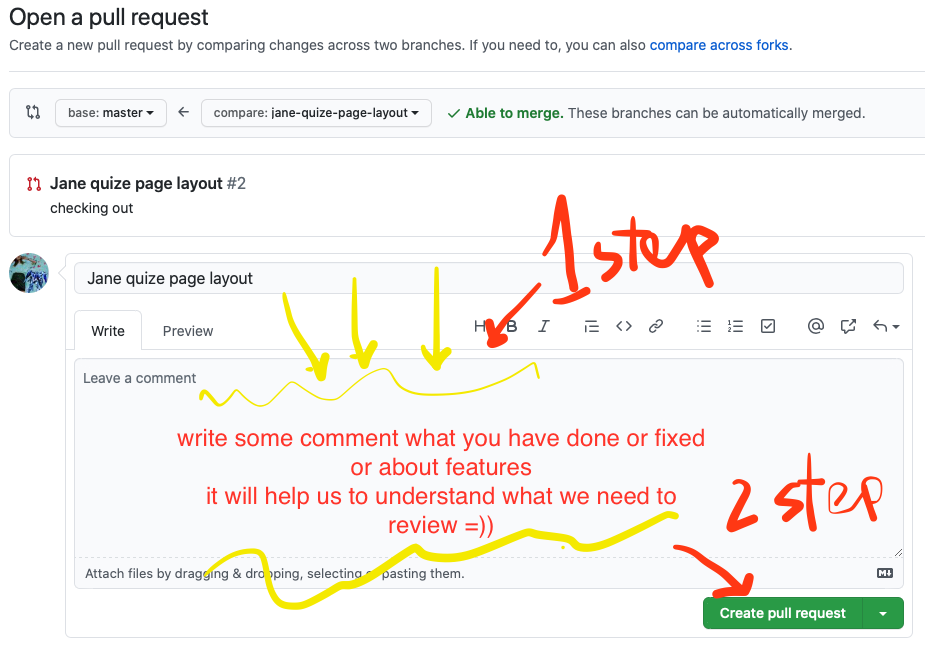

### Git

***when you want to clone repo from GitHub webside***
* go to github.com 
* choose repo you want to clone and follow instructions from image

* create a folder on your local computer where you want to keep repo
```diff
// cteate folder
+    mkdir <name-of-your-folder>

// go inside folder
+    cd <name-of-your-folder>
```
* insert copied link from Github with this comand
```diff
+    git clone <your link>
``` 
* if you are not on the master branch, type in your terminal
```diff
+     ls
```
and check if there any folders. if yes, go there. and you should see 


***Create a branch***

* run this code in your terminal
```diff
+     git checkout -b <name-of-your-branch>
```
it will automaticly created and move you there. Now you shoud see
the name of your new branch at the end of the terminal line.

***About pull requests***

Pull requests let you tell others about changes you've pushed to a branch in a repository on GitHub. Once a pull request is opened, you can discuss and review the potential changes with collaborators and add follow-up commits before your changes are merged into the base branch.

### by simple words ### 
create pull request, when you ready to show your work and feel you can merge it to master branch.




***Basic git flow to push your stuff into your branch***

scheck all the changes
```diff
+     git status
```
add all changes

```diff
+    git add .
```
commit all changes

```diff
+    git commit -m "text of your commit"
```  
and finaly push it to the branch
```diff
+     git push origin <name-of-your branch>
```

***What Does git pull Do?***

### you can check it over [here](https://github.com/git-guides/git-pull) <3